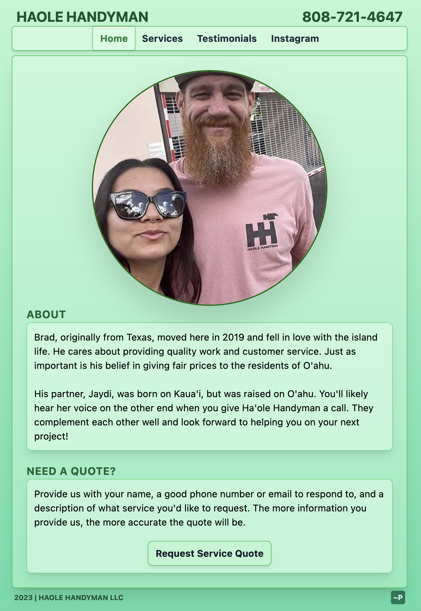

# Haole Handyman

This is a website I made for a business associate that was looking to start advertising online. The website was originally made in HTML and CSS, but having learned React in the last week, I felt it was time for a complete overhaul. On top of that, I also decided to forgo my usual long stylesheets in favor of Tailwind, which I learned while refactoring the site. To be told, this ended up being a nice day project that I think turned out simple, yet effective.

No templates or prefabs were used. All code is from scratch.

Check it out here: [Haole Handyman](https://haolehandyman.com)

## Tools

React, React Router, TailwindCSS, Vite, Vite Image Tools

## Hosting

## Preview

